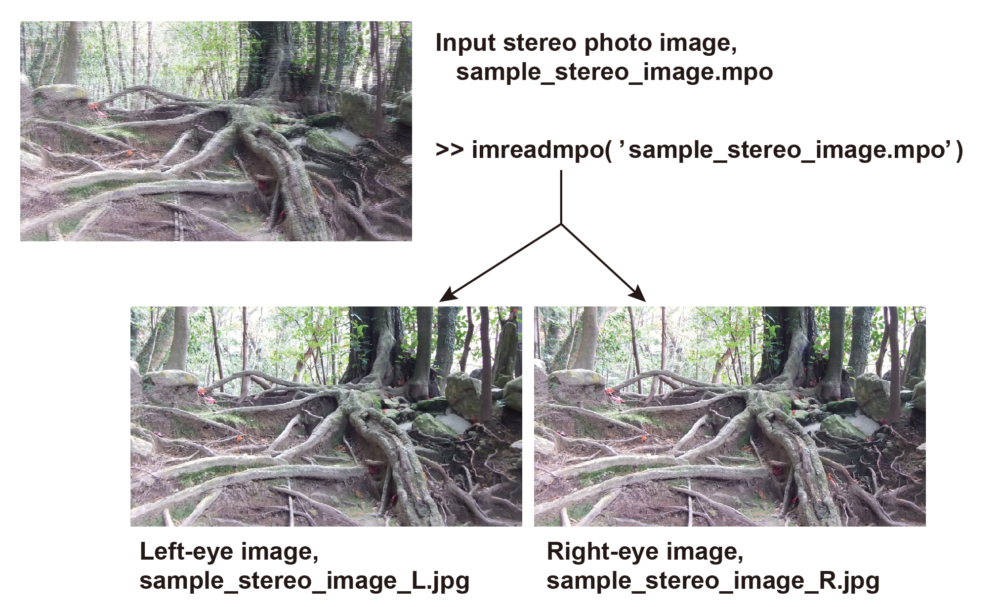

# **README on imreadmpo**

<div align="right">
Created    : "2015-06-30 09:21:28 ban"<br>
Last Update: "2021-12-13 07:29:48 ban"
</div>

<br>
<div align="center">


<br>
<br>
 
</div>
<br>

# <a name = "Menu"> **imreadmpo -- A stereo photo image (*.mpo) reader** </a>



This **MATLAB** function reads an input MPO file and stores the image data as a MATLAB matrix. It is especially focusing on loading two (left/right-eyes) images extracted from one MPO photo file taken with FujiFilm Real W3 stereo camera and storing them separately into a MATLAB matrix. Any MPO file can be processed but have not fully tested yet.  

## **usage**

```Matlab
function [imgs,imgsize,IFD,MPE,header]=imreadmpo(mpofile,:save_flg)
(: is option)
```

## **input**

<pre>mpofile      : input MPO-file name, a RELATIVE path format as the location  
               where this function is called is the origin
               e.g. mpofile='../DSCF0008.mpo';
save_jpg_flg : whether saving the separated left and right-eye images as separated jpg file.  
               [0|1]. 0 by defaut.</pre>

## **output** 

<pre>imgs         : image object, a cell strucuturr  
imgsize      : image size, [height, width]  
IFD          : MP index IDF information  
MPE          : MP entry information  
header       : header information of the input MPO file</pre>

## **note**
<pre>The MPO header structure is as below  
FF E2 00 9E 4D 50 46 00 | 4D 4D 00 2A | 00 00 00 08 | 00 03 B0 00 00 07 ...  
     (APP2 marker)      |  (endian)      (offset)   |  (MP index IFD, 12 byte x N blocks) ... (image data)
                        |                           |
                        | <-- offset_start          | <-- mp_idx</pre>

## **License**  

<br>

imreadmpo -- A stereo photo image (*.mpo) reader. Copyright (c) 2015 Hiroshi Ban. All rights reserved.  

Redistribution and use in source and binary forms, with or without modification, are permitted provided that the following conditions are met:  

    * Redistributions of source code must retain the above copyright
      notice, this list of conditions and the following disclaimer.
    * Redistributions in binary form must reproduce the above copyright
      notice, this list of conditions and the following disclaimer in
      the documentation and/or other materials provided with the distribution

THIS SOFTWARE IS PROVIDED BY THE COPYRIGHT HOLDERS AND CONTRIBUTORS "AS IS" AND ANY EXPRESS OR IMPLIED WARRANTIES, INCLUDING, BUT NOT LIMITED TO, THE IMPLIED WARRANTIES OF MERCHANTABILITY AND FITNESS FOR A PARTICULAR PURPOSE ARE DISCLAIMED. IN NO EVENT SHALL THE COPYRIGHT OWNER OR CONTRIBUTORS BE LIABLE FOR ANY DIRECT, INDIRECT, INCIDENTAL, SPECIAL, EXEMPLARY, OR CONSEQUENTIAL DAMAGES (INCLUDING, BUT NOT LIMITED TO, PROCUREMENT OF SUBSTITUTE GOODS OR SERVICES; LOSS OF USE, DATA, OR PROFITS; OR BUSINESS INTERRUPTION) HOWEVER CAUSED AND ON ANY THEORY OF LIABILITY, WHETHER IN CONTRACT, STRICT LIABILITY, OR TORT (INCLUDING NEGLIGENCE OR OTHERWISE) ARISING IN ANY WAY OUT OF THE USE OF THIS SOFTWARE, EVEN IF ADVISED OF THE POSSIBILITY OF SUCH DAMAGE.  

The views and conclusions contained in the software and documentation are those of the authors and should not be interpreted as representing official policies, either expressed or implied, of the FreeBSD Project.  
