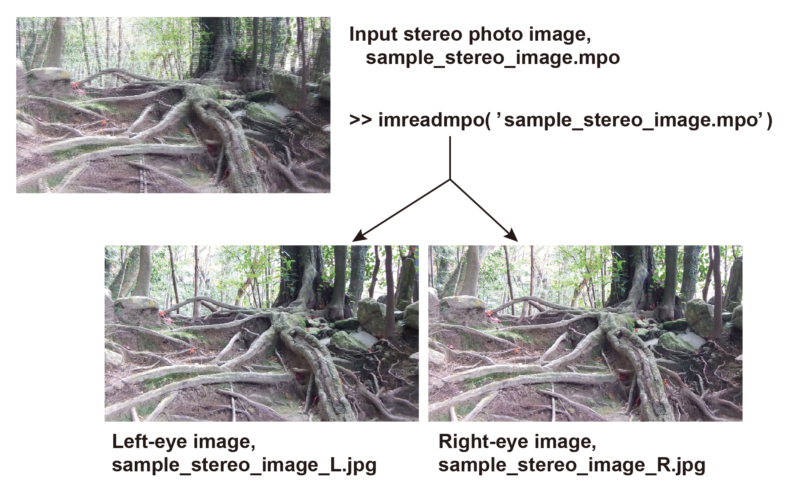

# **README on mporeader**

<div>Created    : "2015-06-30 09:21:28 ban"</div>
<div>Last Update: "2021-06-15 16:54:20 ban"

**********

# <a name = "Menu"> **imreadmpo -- A stereo photo image (*.mpo) reader** </a>



This **MATLAB** function reads an input MPO file and stores the image data as a MATLAB matrix. It is especially focusing on loading two (left/right-eyes) images extracted from one MPO photo file taken with FujiFilm Real W3 stereo camera and storing them separately into a MATLAB matrix. Any MPO file can be processed but have not fully tested yet.  

**usage**

```Matlab
function [imgs,imgsize,IFD,MPE,header]=imreadmpo(mpofile,:save_flg)
(: is option)
```

**input**

<pre>mpofile      : input MPO-file name, a RELATIVE path format as the location  
               where this function is called is the origin
               e.g. mpofile='../DSCF0008.mpo';
save_jpg_flg : whether saving the separated left and right-eye images as separated jpg file.  
               [0|1]. 0 by defaut.</pre>

**output** 

<pre>imgs         : image object, a cell strucuturr  
imgsize      : image size, [height, width]  
IFD          : MP index IDF information  
MPE          : MP entry information  
header       : header information of the input MPO file</pre>

**note**
<pre>The MPO header structure is as below  
FF E2 00 9E 4D 50 46 00 | 4D 4D 00 2A | 00 00 00 08 | 00 03 B0 00 00 07 ...  
     (APP2 marker)      |  (endian)      (offset)   |  (MP index IFD, 12 byte x N blocks) ... (image data)
                        |                           |
                        | <-- offset_start          | <-- mp_idx</pre>
